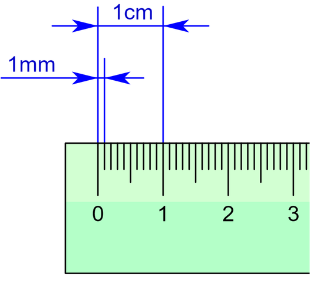

Cada vez que se efectúa una medición, siempre existe la posibilidad de cometer errores de distinta índole durante el proceso. Entre los más comunes podemos distinguir dos grandes grupos:

* **Errores sistemáticos**: Son errores relacionados con la forma en la que su utiliza el instrumento de medida. Dentro de estos podemos distinguir otros como el error de calibrado o el error de paralaje.

	* _Error de calibrado_: Se trata de uno de los errores más frecuentes y está ligado directamente al instrumento. Muchos de ellos deben ser configurados de forma apropiada antes de ser utilizados (calibrado), si esto no se hace correctamente todas las medidas realizadas tendrán añadidas un sesgo.

	* _Error de paralaje_: Es propio de instrumentos de medida analógicos como por ejemplo aquellos que poseen agujas para marcar los valores. Dos observadores situados en posiciones oblicuas a la aguja pueden leer valores diferentes.

* **Errores aleatorios o accidentales**: Se tratan de errores que se producen debido a causas que no se pueden controlar. Para intentar reducir el efecto de este tipo de errores se suele medir varias veces en las mismas condiciones y se considera como valor final más probable la media aritmética de los datos obtenidos.

Por lo tanto, conviene estudiar cuáles son esos errores, a fin de incluirlos en la expresión de una medición experimental. En el mundo científico es común hacer constar cada resultado obtenido en una **medición** junto con la **incertidumbre** sobre esa medida. La **incertidumbre** es un valor numérico que se obtiene por medio de dos nuevos conceptos denominados [error absoluto](#error-absoluto) y [error relativo](#error-relativo).

## Valor real
Es el valor que más se acerca al valor exacto de una medida y está dado, generalmente, por la [media aritmética](#media-aritmetica) (o promedio) de las mediciones experimentales realizadas. 

Si realizamos sólo **una medición**:

* El **valor** será el medido.
* La **incertidumbre** estará dada por la [precisión del instrumento de medida](#precision-del-instrumento).

Si realizamos **N mediciones** en las mismas condiciones:

* Tomaremos como **valor** la [media aritmética $\overline{X}$](#media-aritmetica)
* La **incertidumbre** estará dada por el menor valor entre la [imprecisión absoluta](#imprecision-absoluta) y la [precisión del instrumento de medida](#precision-del-instrumento-de-medida).

Finalmente, para expresar una medida tomada experimentalmente, procederemos del siguiente modo:

$$
X = \overline{X} \pm Incertidumbre
$$

Donde:

* $X$ representa el resultado de la medición
* $\overline{X}$ el valor real
* Incertidumbre que está dada entre la [$E_a$](#imprecision-absoluta) y la [precisión del instrumento de medida](#precision-del-instrumento).

## Precisión del instrumento
La precisión de un instrumento que empleamos para medir está dada por el valor mínimo que es capaz de medir dicho instrumento. 
De esta manera, la precisión de una regla milimetrada escolar es de $\pm 1mm$ ya que es el valor más pequeño que se puede medir con dicho instrumento.

### Error absoluto 
El error absoluto es un indicador de la imprecisión que tiene una determinada media. 

$$
\varepsilon_a = | \overline{X} -  X_i |
$$

#### Imprecisión absoluta
La imprecisión absoluta de varias medidas, se halla sumando las cantidades que se desvía cada medida de la media aritmética, tomadas en valor absoluto (sin tener en cuenta el signo) y divididas por el número de ellas. 

$$
E_a =  \frac{\sum\limits_{i=1}^{N} |\overline{X} - X_i|}{N} = \frac{\varepsilon_{a_1} + \varepsilon_{a_2} + \varepsilon_{a_3} + \cdots + \varepsilon_{a_N}  }{N}
$$

### Error relativo
El error relativo tiene la misión de servir de indicador de la calidad de una medida. Cuando se realizan una medición se considera que su calidad es mucho mayor cuanto más pequeño es el error relativo que se comete.

$$
\varepsilon_r = \frac{\varepsilon_a}{\overline{X}}
$$

#### Error relativo porcentual
Podemos calcular el error relativo en términos de porcentaje de la siguiente manera: 
$$
\varepsilon_r = \frac{\varepsilon_a}{\overline{X}} \cdot 100
$$
		

### Media aritmética
Comunmente conocida como promedio. Puede ser simple o ponderada.

#### Media aritmética simple
$$
\overline{X} = \frac{\sum\limits_{i=1}^{N} X_i}{N} = \frac{X_1 + X_2 + X_3 + \cdots + X_N}{N}
$$

Donde $X_i$ representa el valor de cada medición realizada y $N$ la cantidad de mediciones realizadas. 

#### Media aritmética ponderada
$$
\overline{X} = \frac{\sum\limits_{i=1}^{N} X_i \cdot p_i}{N} =  \frac{X_1 \cdot p_1 + X_2 \cdot p_2 + X_3 \cdot p_3 + \cdots + X_N \cdot p_N}{N}
$$

Donde $X_i$ representa el valor de cada medición realizada, $p_i$ su peso (o frecuencia) y $N$ la cantidad de mediciones realizadas. 
 

## Ejemplo

Si rectangulo 

a= 5,3 +- 0,1	-> amax = 5,4 y	amin = 5,2
b= 2,4 +- 0,2	-> bmax = 2,6 y bmin = 2,2

area max = 5,4 * 2,6 = 14,04 cm^2
area min = 5,2 * 2,2 = 11,44 cm^2

area media = area max + area min
	        ------------------- = 12,74 cm^2
		             2
Error de area

area max - area media = 14,04 - 12,74 = 1,3

ó

area media - area min = 12,74 - 11,44 = 1,3

Area => 12,74 +- 1,3 cm^2

_Fuentes de conocimiento_

* https://www.fisicalab.com/apartado/errores-absoluto-relativos
* https://sites.google.com/site/khriztn/1-3/1-3-1
* http://www.sc.ehu.es/sbweb/fisica/unidades/medidas/medidas.htm
* http://teleformacion.edu.aytolacoruna.es/FISICA/document/fisicaInteractiva/medidas/medidas_directas.htm
* http://recursostic.educacion.es/newton/web/materiales_didacticos/medida/valorrepresent.htm?5&0